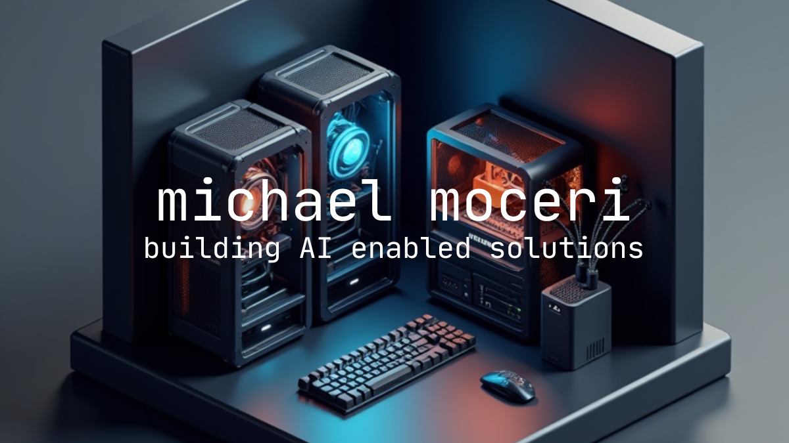

# Michael Moceri's Portfolio Website



This is my personal portfolio website showcasing my projects, skills, and blog. Feel free to use this as a template for your own portfolio. This website is based on my other repository located at: [https://github.com/mimodevconfig/AI-Dev-Portfolio](https://github.com/mimodevconfig/AI-Dev-Portfolio).

## Table of Contents

- [Overview](#overview)
- [Features](#features)
- [Getting Started](#getting-started)
  - [Prerequisites](#prerequisites)
  - [Installation](#installation)
  - [Development](#development)
  - [Building for Production](#building-for-production)
- [Project Structure](#project-structure)
- [Customization Guide](#customization-guide)
  - [Personal Information](#personal-information)
  - [Projects](#projects)
  - [Skills](#skills)
  - [Experience](#experience)
  - [Blog](#blog)
- [Image Management](#image-management)
- [Technologies Used](#technologies-used)
- [Contributing](#contributing)
- [License](#license)

## Overview

This portfolio website is built with React, TypeScript, and Tailwind CSS. It features a modern, responsive design with interactive elements like a skills network map, project showcases, and a blog system. As a professional focused on 3D Printing, Entrepreneurship, Product Development, AI Strategy, and Team Building, this portfolio highlights my expertise and projects in these domains.

## Features

- **Responsive Design**: Looks great on all devices from mobile to desktop
- **Dark/Light Mode**: Automatic theme switching based on user preferences
- **Interactive Skills Network**: Visual representation of skills and their relationships
- **Project Showcase**: Highlight your best work with images and descriptions
- **Blog System**: Share your thoughts and insights with a built-in blog
- **Dynamic World Map**: Visualize global connections and projects
- **Magnetic UI Elements**: Interactive elements with subtle animations
- **Gooey Text Morphing**: Eye-catching text transitions for key skills
- **SEO Friendly**: Optimized for search engines with React Helmet
- **Fast Performance**: Built with Vite for quick loading times
- **TypeScript**: Type-safe code for better development experience
- **Tailwind CSS**: Utility-first CSS framework for easy styling

## Getting Started

### Prerequisites

- Node.js (v18 or higher)
- npm or yarn

### Installation

1. Clone the repository:
   ```bash
   git clone https://github.com/mimodevconfig/michaelmoceri.com.git
   cd michaelmoceri.com
   ```

2. Install dependencies:
   ```bash
   npm install
   # or
   yarn
   ```

### Development

Start the development server:
```bash
npm run dev
# or
yarn dev
```

This will start the development server at `http://localhost:5173`.

### Building for Production

Build the project for production:
```bash
npm run build
# or
yarn build
```

Preview the production build:
```bash
npm run preview
# or
yarn preview
```

## Project Structure

```
/
├── public/                # Static assets
│   ├── images/            # Image assets
│   │   ├── avatar/        # Profile photos
│   │   ├── blog/          # Blog images (covers and content)
│   │   ├── experience/    # Experience-related images
│   │   ├── projects/      # Project images organized by project
│   ├── robots.txt         # Robots file for SEO
│   └── sitemap.xml        # Sitemap for SEO
├── src/
│   ├── components/        # React components
│   │   ├── blocks/        # Reusable block components
│   │   ├── blog/          # Blog-related components
│   │   ├── legal/         # Privacy policy and terms of service
│   │   ├── ui/            # UI components (buttons, avatars, animations, etc.)
│   │   └── various page components (Hero.tsx, About.tsx, etc.)
│   ├── hooks/             # Custom React hooks
│   ├── lib/               # Utility functions and helpers
│   ├── types/             # TypeScript type definitions
│   ├── App.tsx            # Main application component
│   └── main.tsx           # Application entry point
├── index.html             # HTML template
├── package.json           # Project dependencies and scripts
├── tsconfig.json          # TypeScript configuration
├── vite.config.ts         # Vite configuration
├── tailwind.config.js     # Tailwind CSS configuration
└── postcss.config.js      # PostCSS configuration
```

## Customization Guide

### Personal Information

Edit the Hero component to update your name, title, and introduction:
```
src/components/Hero.tsx
```

The Hero component includes:
- Animated text showcasing your key skills and roles
- Profile avatar with verification badge
- Social links
- Call-to-action buttons
- Interactive world map background showing global connections

### Projects

Add your projects by updating the Projects component:
```
src/components/Projects.tsx
```

For each project, you'll need:
- Title
- Description
- Technologies used
- Images (see Image Management section)
- Links to live demo and source code (if available)

Detailed project pages are handled by the ProjectDetail component:
```
src/components/ProjectDetail.tsx
```

### Skills

Customize your skills network in the Skills component:
```
src/components/Skills.tsx
```

The skills are represented as nodes in a network graph, with related skills connected by links using the react-force-graph-2d library.

### Experience

Update your work experience in the Experience component:
```
src/components/Experience.tsx
```

Each experience entry can include:
- Company name and logo
- Position title
- Duration
- Description
- Technologies used
- Image highlighting the experience

### Blog

Blog functionality is implemented through several components:
```
src/components/blog/BlogLayout.tsx
src/components/blog/BlogList.tsx
src/components/blog/BlogPost.tsx
src/components/blog/BlogSearch.tsx
src/components/blog/BlogSidebar.tsx
src/components/blog/CategoryPage.tsx
src/components/blog/TagPage.tsx
```

Blog posts support:
- Markdown/MDX content with frontmatter
- Code syntax highlighting
- Categories and tags
- Cover images
- Responsive layouts

## Image Management

Images are organized in the following structure:

```
/public
  /images
    /avatar           # Profile photos
    /blog             # Blog post images
      /covers         # Blog post cover images
      /content        # Images used within blog posts
    /experience       # Company and work experience images
    /projects         # Project images organized by project
      /3d-printing-calculator
      /100mm-art-foundation
      /ai-research-platform
      /art-config
      /crypto-datacenter-farm
      /fabrication-labs
      /playboy-magazine-cover
      /sustainable-3d-printing-challenge
```

### Image Utility Functions

The `src/lib/imageUtils.ts` file contains helper functions for referencing images:

- `getImageUrl(path)`: Get URL for any image
- `getProjectImageUrl(projectId, filename)`: Get project image URL
- `getBlogCoverUrl(slug)`: Get blog cover image URL
- `getBlogContentImageUrl(slug, filename)`: Get blog content image URL
- `getAvatarUrl(filename)`: Get avatar image URL

## Technologies Used

- [React 18.3.1](https://reactjs.org/) - UI library
- [TypeScript 5.5.3](https://www.typescriptlang.org/) - Type-safe JavaScript
- [Vite 6.2.2](https://vitejs.dev/) - Build tool and development server
- [Tailwind CSS 3.4.1](https://tailwindcss.com/) - Utility-first CSS framework
- [React Router 6.22.3](https://reactrouter.com/) - Routing library
- [Framer Motion 11.0.8](https://www.framer.com/motion/) - Animation library
- [D3-Force 3.0.0](https://github.com/d3/d3-force) - Force simulation for the skills network
- [React Force Graph 1.27.0](https://github.com/vasturiano/react-force-graph) - Graph visualization
- [React Markdown 10.0.0](https://github.com/remarkjs/react-markdown) - Markdown rendering
- [Next MDX Remote 5.0.0](https://github.com/hashicorp/next-mdx-remote) - MDX support
- [Dotted Map 2.2.1](https://www.npmjs.com/package/dotted-map) - Interactive world map
- [Radix UI](https://www.radix-ui.com/) - Headless UI components
- [Lucide React 0.344.0](https://lucide.dev/) - Icon library
- [ESLint 9.9.1](https://eslint.org/) - Code linting
- [PostCSS 8.4.35](https://postcss.org/) - CSS processing

## Contributing

Contributions are welcome! If you find a bug or have a feature request, please open an issue. If you'd like to contribute code, please fork the repository and submit a pull request.

## License

This project is open source and available under the [MIT License](LICENSE).
